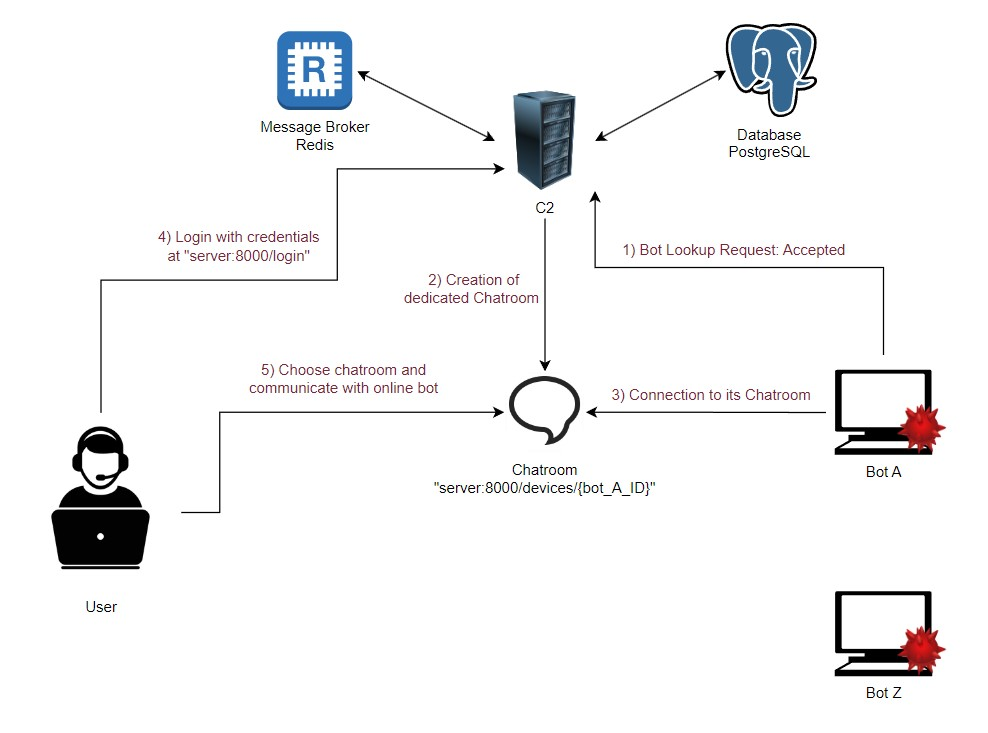
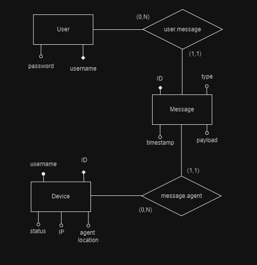

## _DISCLAIMER_ 
This project is developed for educational purposes as part of a university assignment and is not intended for any unauthorized or malicious use. Any use of this project outside its intended educational scope is the sole responsibility of the user.

## OVERVIEW

The framework is constructed on Django, a sophisticated Python web framework renowned for its emphasis on swift development and orderly, pragmatic design principles. For handling communications, Django Channels and Redis are employed. Both are invaluable tools for managing asynchronous and real-time communications effectively via dedicated chatrooms.

PostgreSQL serves as the database backend, offering elevated levels of data management, superior performance, and the capability to handle large volumes of data seamlessly.

The entire system is containerized using Docker, which facilitates effortless deployment, scalability, and the handling of microservices. Additionally, a user interface accessible via a web browser is provided within a container. This interface simulates the behavior of a malevolent user device, allowing for comprehensive testing and evaluation of the system's robustness and security measures.

## WORKFLOW
Here's a graphic image of the workflow: 

## DATABASE
A minimal data structure is chosen to keep the database simple and efficient, facilitating management, maintenance, and insertion operations.    **Legend**  white attributes are primary keys if represented by "◆", and keys if represented by "⚪": 

## REQUIREMENTS
You will just need to have Docker, a terminal, this project copied and a browser. 

## SETUP  
Open the terminal and write: 
`docker-compose up -d --build`                              --> build images for each container and start the containers, this will be your main command to activate the environment  
   __Run These Only Once:__  
`docker exec -d server python3 manage.py migrate`           --> run structural migration on the database based on webapp/library/migrations/0001_initial.py migration file 
`docker exec -d server python3 manage.py createsuperuser`   --> create server admin and insert required data    
_(To prevent embedded credentials, user interaction will be required. Feel free to automate any desired process)_

## ACCESSING C2 SERVER 
After activating the environment, open a browser tab from your device and visit: http://localhost:26901/vnc.html?password=headless 
You will be redirected to an interactive noVNC page. Connect, open Firefox inside this new "machine", and visit http://server:8000.  
You will now see the home page of the C2 Server.   
From here u can login using your admin credentials you set during the SETUP.  
_(Otherwise you can access to Django admin management site on http://server:8000/admin, login with your admin credentials and create a new non-admin user)_  

After authenticating you will be able to see all the devices which are connected to the server along with their Usernames and private IPs.   
By clicking on the "Access shell button" you will be able to communicate with one of them.  
Type "help" to list custom commands (I'm working through some of them).   
To shut down the environment run `docker-compose down`.

## NOTES
- You can manually add agents to the environment. Access the docker-compose.yaml file and add new agents, take inspiration from the already existing one
- __I'mm working on a way to manage input commands on agents!!!__  
Hence, use this semantic `echo 'password' | sudo -S` __`command`__ to send commands which require inputs   
- The only way to actually "eliminate" an agent is by inputting "selfdestroy" command. The agent will be destroyed, but its data will be present in the database to avoid data conflicts. 
- The automatic scroll of the chat is a mistery: it worked previously, now it doesnt. Working on it

